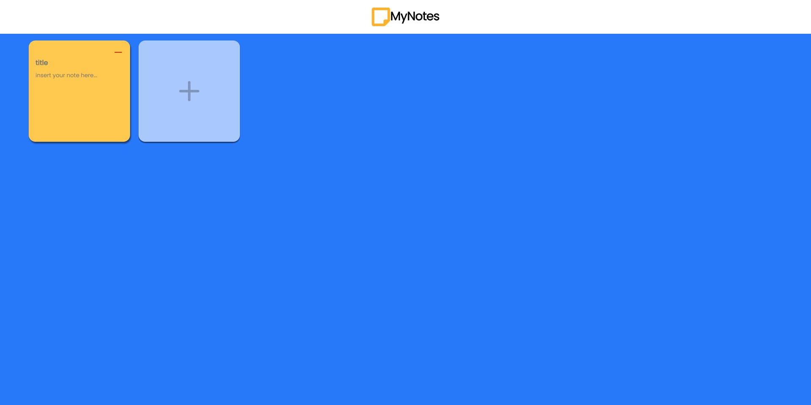
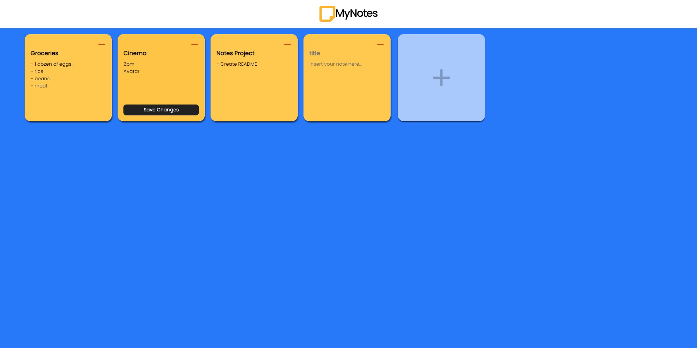
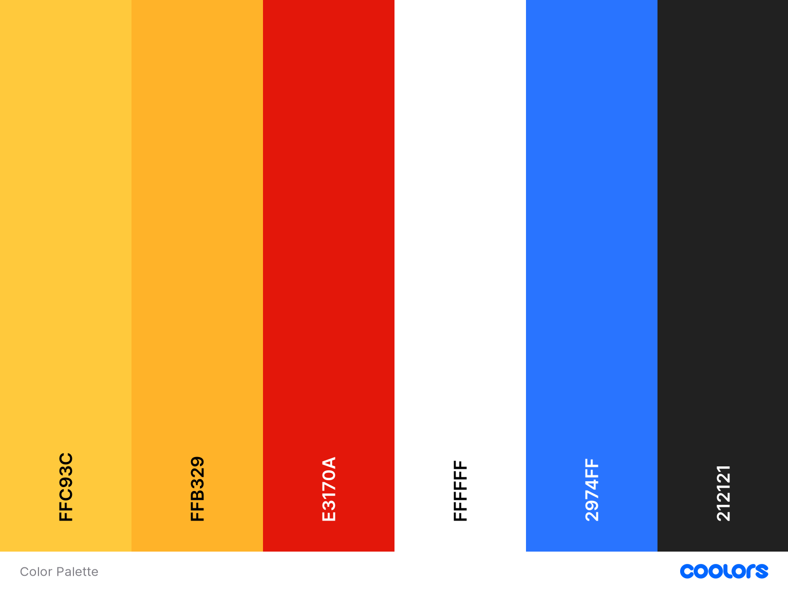

# MyNotes v1.0

The web app to simulate post-it notes.

## Table of contents

- [Overview](#overview)
  - [Screenshots](#screenshot)
  - [Description](#description)
- [My process](#my-process)
  - [Initial ideas](#initial-ideas)
  - [Design](#design)
    - [Color Palette](#color-pallete)
  - [Build with](#build-with)
  - [Challenges](#challenges)
- [Credits](#credits)

## Overview

### Screenshots

### Description

MyNotes is an intuitive post-it simulator for navigators. Add and remove notes (literally) on a click. New functionalities coming soon!

## My process

### Initial ideas

At first, my intention was to build an utra-simple post-it app that anyone could use to write their notes. Then I realize that it could be a greater project since I keep updating its functionalities while I learn about new front-end concepts.

### Design

The color choicing was made having its simplicity in mind, in a way that not only generates good contrast but also matches with real world concepts.

#### Color Pallete

### Build with

- CSS Grid
- React
- Synchronous States
- Styled Components
- Local Storage

### Challenges

1. Learning CSS Grid from scratch:
- Understanding how to create responsive grids for mobile and desktop versions
- Setup the best grid configuration to different sizes of screens

2. Coping with IDs:
- Understanding how identifiers should work to delete elements from a page

3. Animations:
- Learning how CSS Animations and Keyframes work to create dynamic elements that response to the user interaction

## Credits

Some of my friends gave me nice tips to help my deevelopment process and I can't help but mention them here:

- Danilo Medeiros: [GitHub](https://github.com/Dhanilow15)
- Heitor Callipo: [GitHub](https://github.com/heitorcallipo)
- Lucas Agnez: [Github](https://github.com/LucasAgnez)
- Rafael Gomes: [GitHub](https://github.com/rafaelgdgs)
